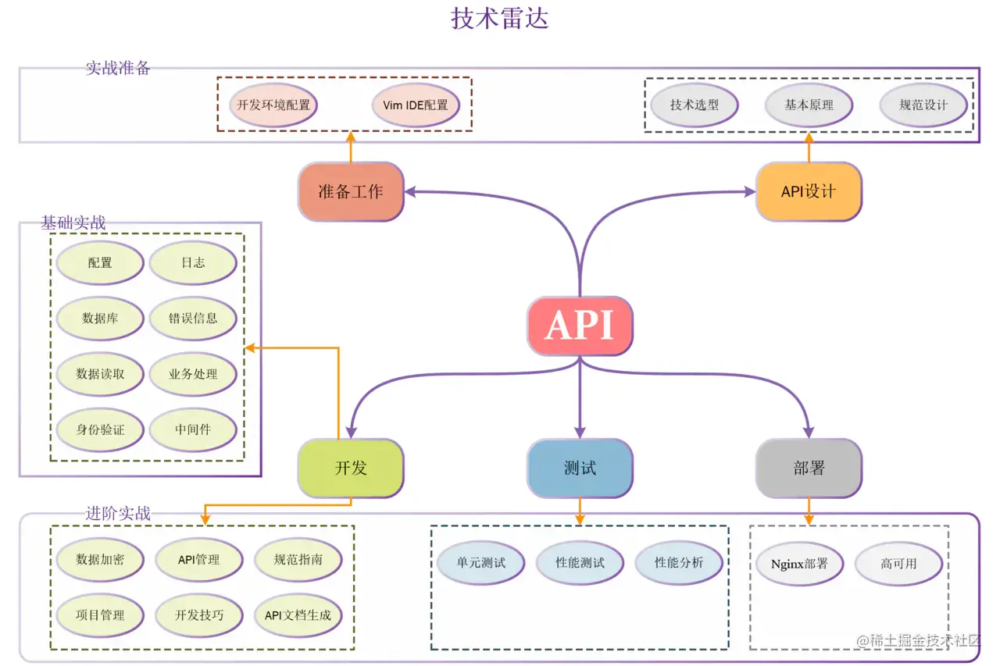

## 目录

**注意：** 此项目不再维护，如果想学习本项目可以移步：https://github.com/marmotedu/goserver

**另外**：此课程已经升级为极客时间课程，课程介绍[《Go 语言项目开发实战》](https://time.geekbang.org/column/intro/100079601)，建议学习该课程，更专业、内容更多。

## apiserver_demos 项目介绍

本教程是掘金小册：[基于 Go 语言构建企业级的 RESTful API 服务](https://juejin.cn/book/6844733730678898702) 实战类教学项目,旨在让初学者花尽可能短的时间，通过尽可能详细的步骤，历经 17 个 demo，最终一步步构建出一个生产级的 API 服务器。从开发准备到 API 设计，再到 API 实现、测试和部署，每一步都详细介绍了如何去构建。通过本教程的学习，你将学到如下知识点：

知识点很多，跟着教程一节一节进行学习，你将完整的学会如何用 Go 做 API 开发。

## 源码目录介绍

| 目录 | 介绍 |
| --- | --- | 
| demo01 |实战：启动一个最简单的 RESTful API 服务器 | 
| demo02 |实战：配置文件读取 |
| demo03 |实战：记录和管理 API 日志 |
| demo04 |实战：初始化 MySQL 数据库并建立连接 |
| demo05 |实战：自定义业务错误信息 |
| demo06 |实战：读取和返回 HTTP 请求 |
| demo07 |实战：用户业务逻辑处理（业务处理） |
| demo08 |实战：HTTP 调用添加自定义处理逻辑 |
| demo09 |实战：API 身份验证 |
| demo10 |进阶：用 HTTPS 加密 API 请求 |
| demo11 |进阶：用 Makefile 管理 API 项目 |
| demo12 |进阶：给 API 命令增加版本功能 |
| demo13 |进阶：给 API 增加启动脚本 |
| demo14 |进阶：基于 Nginx 的 API 部署方案 |
| demo15 |进阶：go test 测试你的代码 |
| demo16 |进阶：API 性能分析 |
| demo17 |进阶：生成 Swagger 在线文档 |

## 项目适宜人群

- 掌握一定 Go 语法基础，零 Go 服务器研发经验，想通过一个完整的实战，来系统学习 Go 服务器开发的同学;
- 有意从事 Go 服务器开发，但尚未入门或入门尚浅的同学;
- 有过 Go 服务器开发经验，但想了解某一部分构建方法的同学。

## 你应该具备什么

- 基本的 Go 语言编程知识
- 基本的 Linux/Uinx 命令行知识
